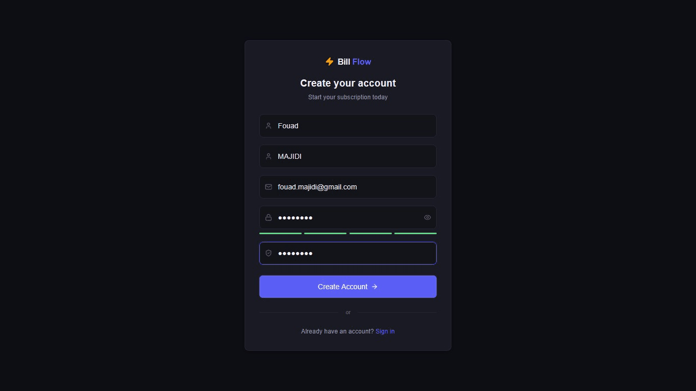
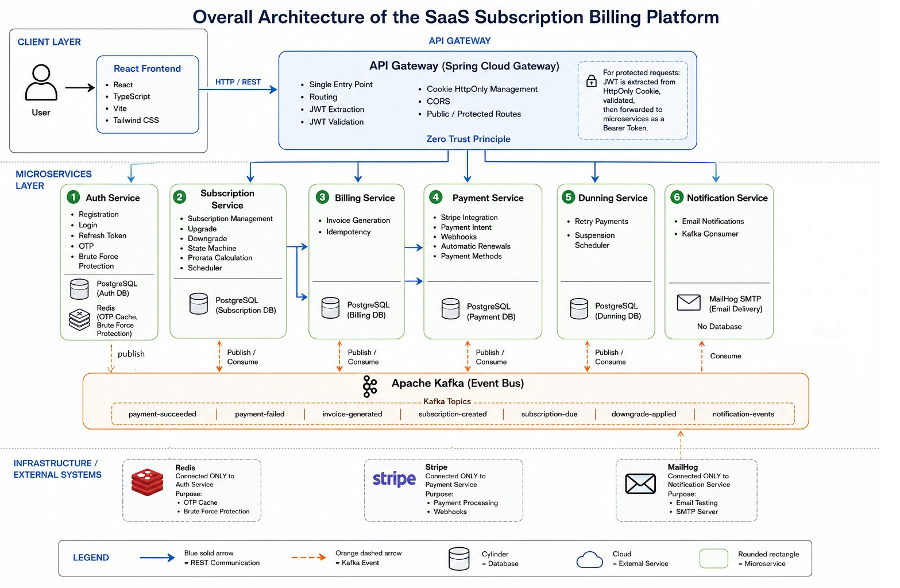
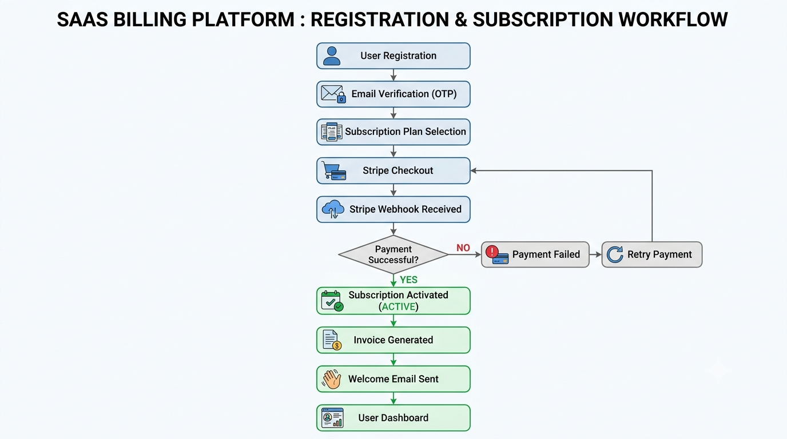
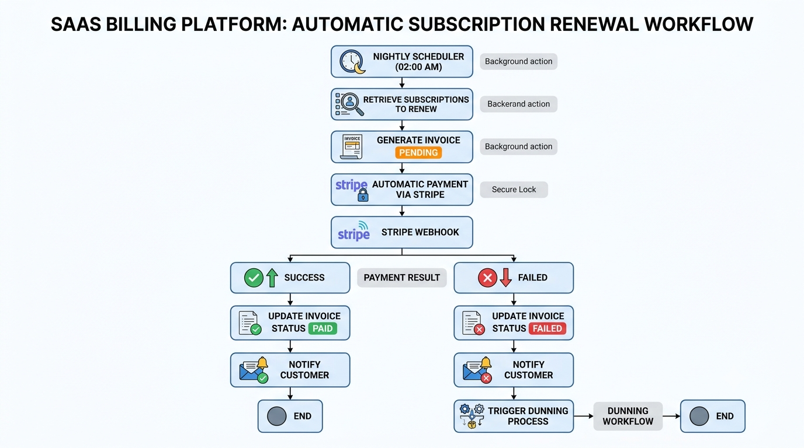
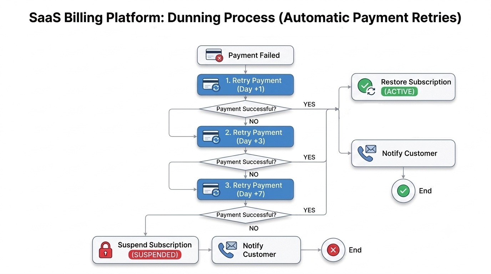

# SaaS Billing Platform

A scalable, microservices-based platform that automates the full recurring billing lifecycle — subscriptions, invoicing, payments, and dunning — for SaaS businesses.


---

## Overview

Manual recurring billing is slow and error-prone. This platform automates the entire lifecycle — from subscription creation to payment collection, retries, and renewal — using an event-driven microservices architecture.

**Customers** can create accounts, subscribe to plans (Starter, Pro, Enterprise), manage payment methods, view invoices, upgrade/downgrade plans, and track subscription status.

**Admins** can manage plans, view all users, and monitor payments and failures (API-based).



---

## Architecture

The platform follows a **microservices architecture** with **database-per-service**, separating each business domain into an independently deployable service with its own data ownership.

The **React frontend** communicates exclusively with the **API Gateway**, which acts as the single entry point to the backend. The Gateway handles routing, CORS, authentication enforcement, and JWT extraction from secure **HttpOnly cookies** before forwarding authenticated requests to internal services.

The backend combines **synchronous REST communication** for operations requiring an immediate response with **asynchronous Kafka events** for decoupled business workflows such as billing, payment processing, and notifications.



| Service | Responsibility |
|---|---|
| **API Gateway** | Single entry point, routing, CORS, authentication enforcement |
| **Auth Service** | Registration, authentication, OTP verification, JWT management, brute-force protection |
| **Subscription Service** | Subscription lifecycle, state machine, plan changes, prorata calculation, renewal scheduling |
| **Billing Service** | Invoice generation and idempotency |
| **Payment Service** | Stripe integration, payment methods, PaymentIntents, webhook processing |
| **Dunning Service** | Failed payment recovery and scheduled payment retries |
| **Notification Service** | Event-driven email notifications |

### Communication & Service Isolation

- **REST** is used for synchronous operations that require an immediate response.
- **Apache Kafka** enables asynchronous, event-driven communication between services.
- Each business service owns its **dedicated PostgreSQL database**, preventing direct access to another service's data.
- **Redis** is isolated to the Auth Service for OTP storage and brute-force protection.
- **Stripe** is isolated to the Payment Service, centralizing payment processing and webhook handling.
- The **Notification Service is stateless** and consumes Kafka events to deliver transactional emails.

This separation keeps business responsibilities isolated while allowing services to collaborate through well-defined APIs and events.

## Key Features

### Customer

- Register and verify email address via OTP
- View available subscription plans
- Subscribe to a plan
- Upgrade or downgrade the current subscription
- Cancel the subscription
- View subscription details and status
- View subscription events
- View personal invoices and payment history
- Manage the saved payment method

### Admin

- Create and deactivate subscription plans
- Manage customer subscriptions
- View and filter customer invoices
- View customer payment history
- Manage customer payment methods when required

### Automated Billing

- Automatically generate invoices for subscriptions reaching their renewal date
- Automatically charge the customer's saved payment method through Stripe
- Apply prorated charges when a customer changes subscription plans
- Automatically retry failed payments at J+1, J+3, and J+7
- Automatically cancel pending retries when a payment succeeds
- Automatically suspend a subscription after all payment retries fail
- Automatically send email notifications for important billing and subscription events

> **Note:** Admin capabilities are currently exposed through REST APIs and can be tested via tools such as Postman. A dedicated admin interface is not currently implemented.
---

## Core Workflows

### Registration & Subscription

The subscription workflow takes a user from registration to an active subscription. After verifying their email via OTP, the user selects a plan and completes the payment through Stripe. The payment result is confirmed asynchronously through a Stripe webhook.

On successful payment, the subscription is activated, the first invoice is generated, and a welcome notification is sent. Failed payments are handled through the payment retry and dunning process.



### Automatic Subscription Renewal

A nightly scheduler identifies subscriptions due for renewal and generates a `PENDING` invoice using an idempotency mechanism to prevent duplicate billing. The Payment Service then attempts to charge the customer's saved payment method through Stripe.

Stripe asynchronously confirms the payment result through a **webhook**. On success, the invoice is marked `PAID` and the customer is notified. On failure, the invoice is marked `FAILED`, the customer is notified, and the **Dunning workflow** is triggered to recover the payment through scheduled retries.



### Dunning
On `PaymentFailed`, the Dunning Service schedules retries at J+1, J+3, and J+7, attempting payment via Stripe each time. A successful retry restores `ACTIVE` status; exhausting all retries suspends the subscription.



---

## Tech Stack

**Backend:** Java 21, Spring Boot, Spring Security, Spring Data JPA, Spring Validation

**Microservices & API Gateway:** Spring Cloud Gateway, REST (`RestClient`)

**Messaging:** Apache Kafka (asynchronous, event-driven communication)

**Scheduling:** Quartz Scheduler

**Frontend:** React, TypeScript, Tailwind CSS, Vite

**Database & Caching:** PostgreSQL (database-per-service), Redis (OTP and brute-force protection)

**Payments:** Stripe API, Stripe Java SDK

**Testing:** JUnit 5, Mockito

**DevOps:** Docker, Docker Compose

---

## Security

- **Authentication:** JWT + Refresh Tokens issued on login
- **Authorization:** Role-Based Access Control (`CUSTOMER`, `ADMIN`)
- **Token storage:** JWT stored in HttpOnly cookies to mitigate XSS
- **CORS:** Configured at the API Gateway
- **Brute-force protection:** Redis-backed failed-login counter; account locked after 5 consecutive failures
- **Password security:** BCrypt hashing
- **Idempotency keys** to prevent double billing
- **Stripe webhook signature verification**
- **Input validation** Request validation using Spring Validation

---

## Testing

Core business logic is covered with unit tests using **JUnit 5, Mockito, and Spring Test**.

| Component | Tests |
|---|---:|
| AuthService | 17 |
| JwtService | 8 |
| SubscriptionStateMachineService | 23 |
| ProrataCalculatorService | 12 |
| IdempotencyService | 8 |
| InvoiceService | 5 |
| DunningService | 9 |

**82 tests — 82 passed (100%)**

## Technical Challenges

### Distributed System Complexity

**Challenge:** Implementing business workflows across multiple independent microservices made coordination, debugging, and data consistency more complex than in a monolithic application.

**Solution:** Responsibilities were clearly separated by business domain, and complex features were developed incrementally with testing at each stage. Service communication was handled through well-defined REST APIs and Kafka events.

### Asynchronous Event-Driven Communication

**Challenge:** Kafka introduced asynchronous communication between services, making event flows and dependencies harder to trace and manage.

**Solution:** Business events were explicitly modeled with clear producer/consumer responsibilities, allowing services to remain decoupled while reliably exchanging domain events.

### Stripe Payment Consistency

**Challenge:** Payment processing required keeping the platform's internal state consistent with Stripe, while handling asynchronous payment results and webhook retries.

**Solution:** Stripe webhooks were used as the source of truth for payment outcomes, with signature verification and controlled event processing to keep internal invoice and subscription states synchronized.

### Idempotency & Double Billing Prevention

**Challenge:** Scheduled jobs and asynchronous events can be executed or delivered more than once, creating a risk of duplicate invoices or double charges.

**Solution:** Idempotency mechanisms were introduced for critical operations using unique idempotency keys, ensuring that repeated executions of the same business operation do not produce duplicate effects.

---

## Running the Project

### Prerequisites
- Docker and Docker Compose installed

### Setup

```bash
git clone https://github.com/bilal-essafrioui/saas-billing-platform.git
cd saas-billing-platform
```

Configure required environment variables (Stripe keys, database credentials, Kafka broker address) in your `.env` file :

```text
STRIPE_API_KEY=<YOUR_VALUE>
DB_USERNAME=<YOUR_VALUE>
DB_PASSWORD=<YOUR_VALUE>
KAFKA_BROKER=<YOUR_VALUE>
```

### Start all services

```bash
docker-compose up -d
```

This spins up all microservices, PostgreSQL databases, Kafka, Redis, and MailHog.

The **API Gateway** is the single entry point for the backend. The **frontend** is served on the port defined in `docker-compose.yml`.

---

## Project Structure

```text
saas-billing-platform/
├── api-gateway/
│   ├── src/
│   └── Dockerfile
├── auth-service/
│   ├── src/
│   └── Dockerfile
├── subscription-service/
│   ├── src/
│   └── Dockerfile
├── billing-service/
│   ├── src/
│   └── Dockerfile
├── payment-service/
│   ├── src/
│   └── Dockerfile
├── dunning-service/
│   ├── src/
│   └── Dockerfile
├── notification-service/
│   ├── src/
│   └── Dockerfile
├── client/
│   ├── src/
│   └── Dockerfile
├── docker-compose.yml
└── README.md
```

---

## Author

**ESSAFRIOUI Bilal**

[GitHub](https://github.com/bilal-essafrioui) · [LinkedIn](https://www.linkedin.com/in/bilal-essafrioui/) · [Portfolio](https://bilal-essafrioui.netlify.app/)

## License

This project is licensed under the MIT License - see the [LICENSE](LICENSE) file for details.